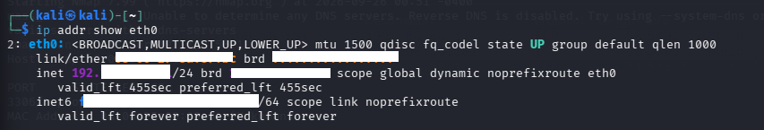

# Windows Network Security Assessment Using Kali Linux, Nmap and Wireshark

## Project Overview
This project demonstrates a controlled network security assessment of a Windows 11 system using Kali Linux, Nmap, and Wireshark.

The assessment was performed in an isolated VirtualBox lab network using systems owned/controlled by the student. No firewall rules were modified and no exploitation was performed.

## Objective
- Discover the Windows host on the isolated lab network.
- Identify accessible TCP ports.
- Identify services running on open ports.
- Capture and analyze network traffic using Wireshark.
- Document findings and basic security recommendations.

## Lab Environment

| Component | Details |
|---|---|
| Assessment Machine | Kali Linux |
| Target Machine | Windows 11 |
| Virtualization | Oracle VirtualBox |
| Network Type | Host-only / isolated lab network |
| Kali Address | `KALI_IP` |
| Windows Address | `TARGET_IP` |
| Tools | Nmap, Wireshark |

> **Privacy note:** IP addresses and MAC addresses have been anonymized in the public version of this repository.

## Lab Architecture

```text
+------------------+             +------------------+
|   Kali Linux     |             |    Windows 11    |
| Assessment Host  |             |   Target Host    |
|    KALI_IP       |             |    TARGET_IP     |
+--------+---------+             +---------+--------+
         |                                 |
         +---------- Isolated -------------+
                    VirtualBox
                   Lab Network
```

## Tools Used

### Nmap
Used for host discovery, TCP port scanning, and service detection.

### Wireshark
Used to capture and analyze ICMP and TCP traffic.

## Methodology

### 1. Host Discovery

```bash
sudo nmap -sn TARGET_IP
```

The target host was detected as active by Nmap. Although ICMP Echo Requests did not receive replies, Nmap was able to identify the host through ARP-based discovery on the local lab network.

### 2. TCP Port Scan

```bash
sudo nmap -sS TARGET_IP
```

The scan identified:

```text
3306/tcp open mysql
```

Most of the remaining default TCP ports were reported as filtered/no-response.

### 3. Service Detection

```bash
sudo nmap -sV -p 3306 TARGET_IP
sudo nmap -sV -p 3306 --reason TARGET_IP
```

Nmap reported:

```text
3306/tcp open mysql syn-ack ttl 128 MySQL (unauthorized)
```

This indicates that port 3306 responded to the TCP SYN probe and Nmap identified the service as MySQL. The exact MySQL version could not be determined; Nmap reported `unauthorized` during service detection.

The `TTL 128` value is consistent with a Windows TCP/IP stack, although TTL alone is not definitive operating-system identification.

# Wireshark Analysis

## 4. ICMP Traffic Analysis

Wireshark was used to capture traffic on the Kali `eth0` interface.

Display filter:

```text
icmp
```

Ping command:

```bash
ping -c 4 TARGET_IP
```

Wireshark captured ICMP Echo Request packets from Kali to the Windows target, with no corresponding Echo Reply packets observed.

No Windows firewall configuration was changed during this experiment.

## 5. TCP Port 3306 Analysis

Wireshark was used to observe traffic generated by an Nmap SYN scan against port 3306.

Display filter:

```text
tcp.port == 3306
```

Observed sequence:

```text
Kali Linux        Windows 11
    |                  |
    | ---- SYN ------> |
    | <--- SYN/ACK --- |
    | ---- RST ------> |
    |                  |
```

- **SYN:** Kali initiated a TCP connection attempt.
- **SYN/ACK:** Windows responded, indicating that port 3306 was accepting the connection attempt.
- **RST:** Kali terminated the half-open connection, which is typical behavior during an Nmap SYN scan.

This packet-level observation supports the Nmap result that TCP port 3306 was open.

# Findings

| Finding | Observation |
|---|---|
| Host Discovery | Windows target detected as active |
| ICMP | Echo Requests observed; no Echo Replies |
| TCP Port | `3306/tcp` open |
| Service | MySQL identified |
| Version | Exact version not determined |
| TCP Behavior | SYN → SYN/ACK → RST observed |
| Other Ports | Most default TCP ports filtered/no-response |

# Security Recommendations

1. Verify whether MySQL needs to be network-accessible.
2. Restrict database access to trusted hosts where appropriate.
3. Keep MySQL updated and use a supported version.
4. Avoid exposing database services unnecessarily.
5. Monitor network traffic for unexpected connection attempts.

# Limitations

- Only the student's own Windows 11 system was assessed.
- The network was isolated using VirtualBox.
- No public or third-party systems were scanned.
- No exploitation was performed.
- No passwords or credentials were tested.
- No Windows Firewall rules were modified.
- Nmap could not determine the exact MySQL version.

# Screenshots

The public screenshots have been sanitized to remove local IP addresses and MAC addresses.

### 1. Network Setup



### 2. Host Discovery


### 3. TCP Port Scan


### 4. Service Detection


### 5. Wireshark ICMP Analysis


### 6. Wireshark TCP 3306 Analysis


# Conclusion

This project demonstrates a basic network security assessment workflow using Kali Linux, Nmap, and Wireshark.

The assessment demonstrated host discovery, TCP port scanning, service identification, and packet-level analysis of ICMP and TCP traffic. Nmap findings were also validated at the packet level using Wireshark.

# Interview Explanation

> I created a controlled Windows network security assessment lab using Kali Linux, Nmap, and Wireshark. I first discovered the Windows host, then performed a TCP SYN scan and identified port 3306 running a MySQL service. I used Nmap service detection to gather additional information, although the exact MySQL version could not be determined. I then used Wireshark to analyze ICMP traffic and TCP behavior on port 3306. The packet capture showed the SYN, SYN-ACK, and RST sequence associated with the Nmap SYN scan. The entire experiment was performed on my own Windows system in an isolated VirtualBox network without modifying firewall rules or performing exploitation.

## Disclaimer

This project was performed for educational and defensive security learning purposes in a controlled lab environment. Only systems owned or authorized by the student were assessed.
